# M5VoiceRecorder

A pocket voice recorder for the [M5StickS3](https://docs.m5stack.com/en/core/StickS3).
Press the blue button to record to the internal flash; press the side button
to open a Wi-Fi access point and record, listen to, download or delete the
recordings from a browser. No SD card, no app, no extra hardware.

<p align="center">
  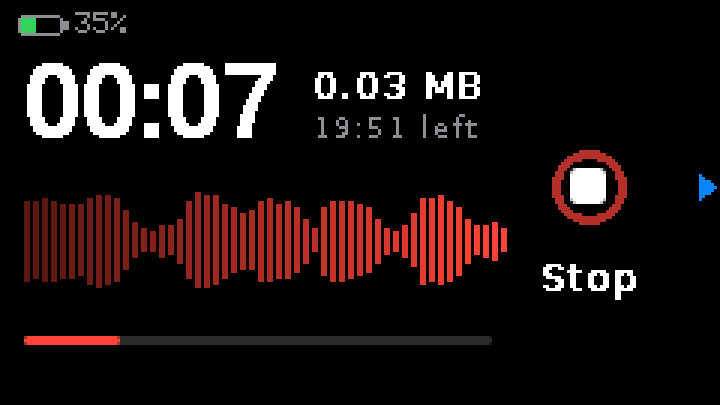
</p>

## Features

- **One-button recording.** KEY1 starts and stops. While recording: a running
  timer, megabytes written, time left, a live waveform and a pulsing ring
  around the Stop button.
- **About 24 minutes** of audio in the 5.9 MB of flash left after the
  firmware: IMA ADPCM WAV, 8 kHz mono, about 4 KB per second.
- **Wi-Fi control.** KEY2 turns on an open access point, *Voice Recorder*. At
  http://192.168.4.1 you can start and stop a recording (with a live timer
  and waveform), and every recording is listed with its length and size, to
  play in the browser, download, delete, or delete all at once.
- **Survives power loss.** Files are synced every 10 seconds; if the power is
  cut mid-recording, the header is repaired at the next start and the audio
  up to the last sync plays normally.
- **Landscape UI** designed for the device held sideways, with on-screen hints
  pointing at the physical buttons.

## Buttons

| Button | Where | What it does |
|---|---|---|
| KEY1 | blue, on the front, right of the screen | start / stop recording (in Wi-Fi mode: stop only; start from the page) |
| KEY2 | on the top edge, above the right part of the screen | Wi-Fi mode on / off |
| Power | handled by the power chip, not the firmware | press: on / reset, double press: off, hold: download mode |

When the screen has gone dark to save the battery, the first press only wakes
it. While recording, the screen never turns off; it only dims after 30 seconds.

## Screens

| | |
|---|---|
| 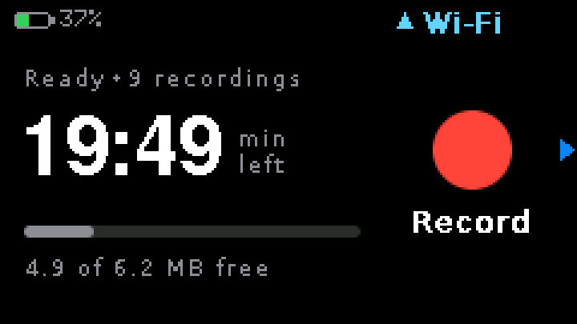 |  |
| **1 · Ready.** Recording time left, storage used. | **2 · Recording.** Timer, size, time left, waveform. |
| 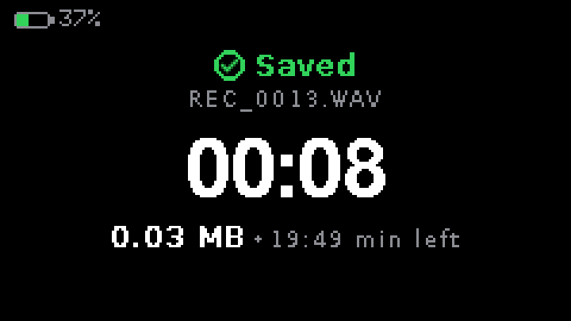 | 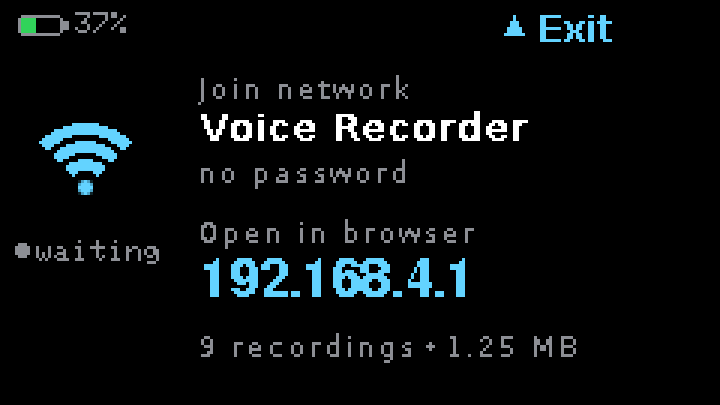 |
| **3 · Saved.** Shown for 4 seconds, then fades back to 1. | **4 · Wi-Fi.** Network name and the address to open. |
| 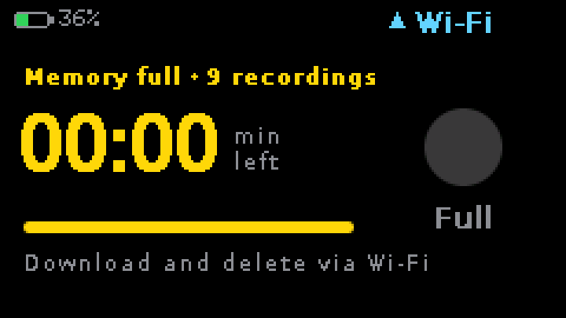 | 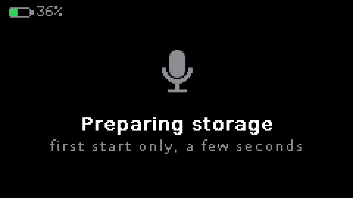 |
| **5 · Memory full.** Recording is blocked until files are deleted. | **6 · First start.** The storage is formatted once. |
| 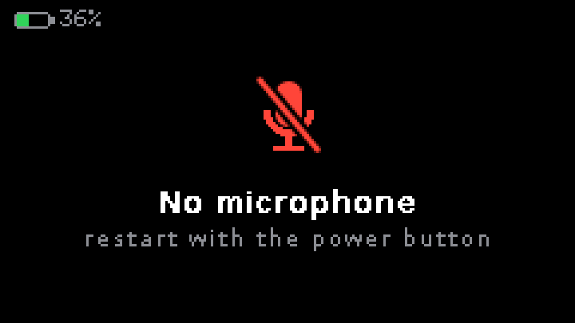 | 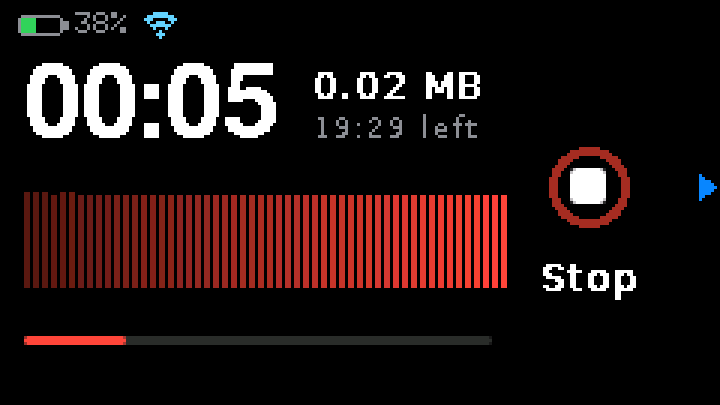 |
| **7 · Error.** The microphone did not start. | **8 · Recording from the web page.** Screen 2 with the Wi-Fi mark. |
| 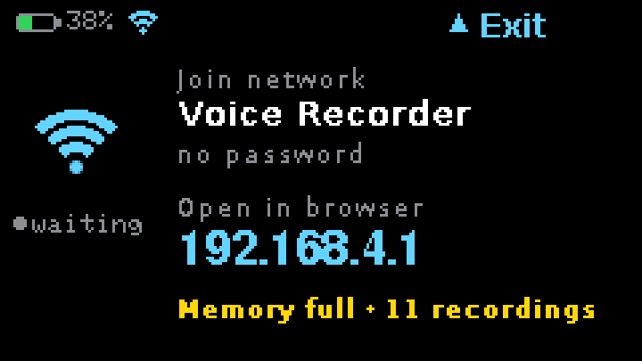 | |
| **9 · Wi-Fi, memory full.** Delete recordings from the page to record again. | |

While Wi-Fi is on, a small Wi-Fi mark next to the battery says so on every
screen.

The screenshots are taken from the device itself over USB
(`tools/serial_cmd.py snap`).

## The web page

1. Press **KEY2**. The screen shows the network name and address.
2. On a computer or phone, join the Wi-Fi network **Voice Recorder** (no
   password). While connected, that device has no internet.
3. Open **http://192.168.4.1**.
4. **Record** starts a recording on the stick; the page shows the timer, the
   size, the time left and a live waveform, and **Stop** ends it (KEY1 on the
   stick stops it too). While recording, the list waits: playing and
   downloading would interrupt the recording.
5. Play, download or delete recordings; **Delete all** at the bottom of the
   list asks before it removes everything. Downloaded files open in VLC,
   QuickTime or Windows Media Player.
6. Press **KEY2** again to switch Wi-Fi off.

| | |
|---|---|
| 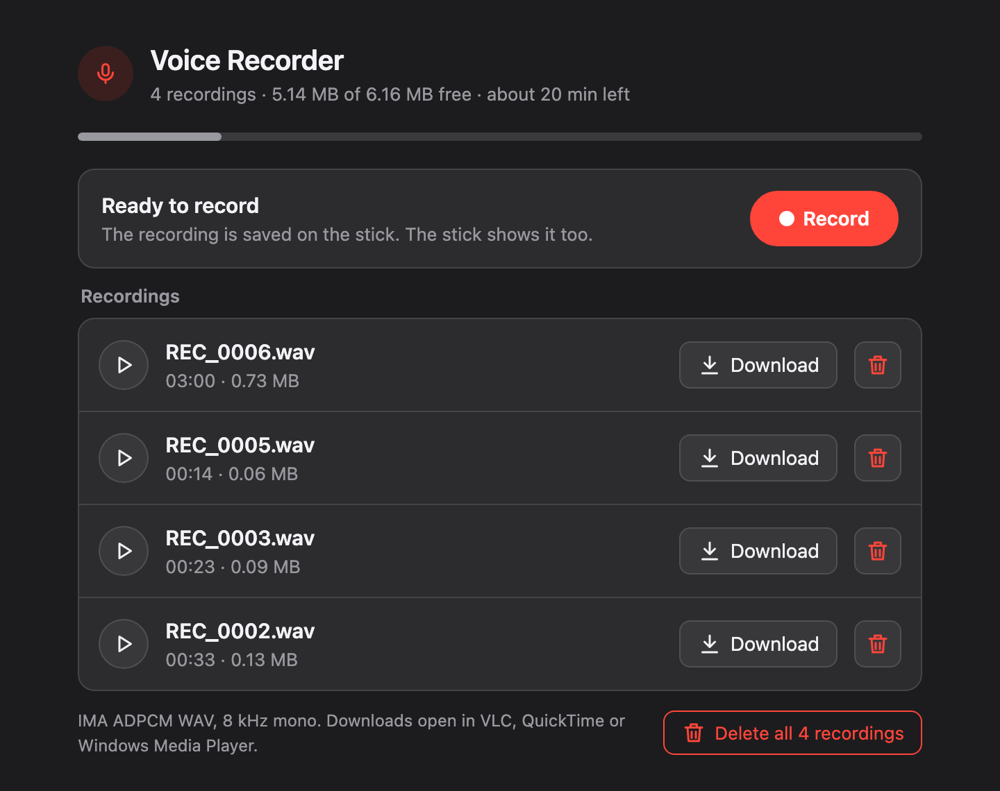 | 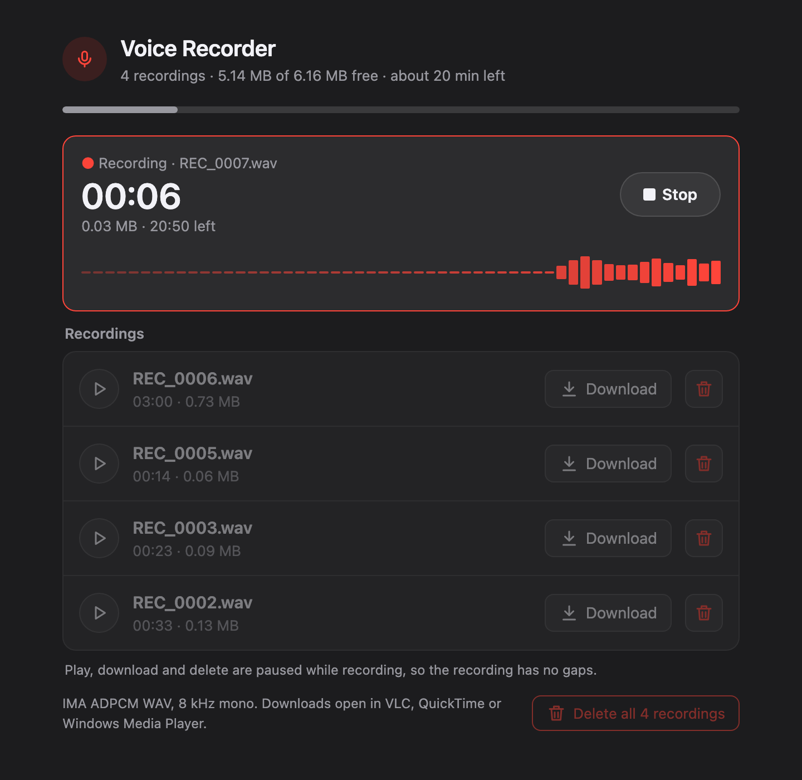 |
| Ready | Recording |

Recordings are named `REC_0001.wav`, `REC_0002.wav`, … The StickS3 has no
real-time clock, so they are numbered rather than dated; numbers never repeat,
even after deleting files.

## Recording format

| | |
|---|---|
| Container | WAV |
| Codec | IMA ADPCM (format tag 0x11), 4 bits per sample |
| Sample rate | 8 kHz, mono (telephone quality, speech up to about 3.5 kHz) |
| Data rate | about 4 KB/s, 0.24 MB per minute |
| Capacity | about 24 minutes in total |

IMA ADPCM is a quarter of the size of 16-bit PCM and costs the
microcontroller a few additions per sample, so recording leaves the CPU
almost idle. Browsers cannot play it natively, so the web page decodes it in
JavaScript; desktop players handle it as is.

## Building and flashing

Needs [PlatformIO](https://platformio.org/). The commands below use the path
of the official installer; use plain `pio` if it is on your `PATH`.

```bash
~/.platformio/penv/bin/pio run -e sticks3 -t upload     # build and flash over USB
~/.platformio/penv/bin/pio device monitor -e sticks3    # serial log, 115200 baud
~/.platformio/penv/bin/pio test -e native               # unit tests on the computer
```

If the upload cannot connect, hold the power button until the internal green
LED blinks (download mode) and try again.

**M5Burner.** `pio run -e sticks3 -t merged` builds
`.pio/build/sticks3/firmware-merged.bin`, a full image to be written at
address 0x0, which is what M5Burner expects.

The project uses its own partition table (`partitions.csv`): a 2 MB
application and a 5.9 MB LittleFS partition for the recordings, formatted on
the first start.

## How it is built

```
lib/     hardware-free logic, unit-tested on the computer
  ImaAdpcm       ADPCM encoder and decoder
  WavHeader      WAV header, repair after power loss, bytes <-> time
  RecorderState  modes, button handling, screen fades
  ScreenPolicy   backlight on / dim / off
  LevelMeter     waveform bars
  Recordings     file names, time and size formatting
  BatteryFilter  steady battery percentage
  BlockRing      microphone block bookkeeping
src/     everything that touches the board
  AudioCapture   microphone (ES8311 codec) at 8 kHz
  RecordingWriter, Storage   files in LittleFS
  WebPortal, WebPage.h       access point, web server, the page
  Renderer       the nine screens
  main.cpp       wiring, serial test commands
tools/   test and build helpers
```

## Testing

The logic in `lib/` has 69 unit tests that run on the computer
(`pio test -e native`).

The audio path is tested end to end on the real device: the computer plays
known sounds into the microphone, the recorder records them through serial
commands, and the file is pulled back over USB and analysed.

```bash
PY=~/.platformio/penv/bin/python
$PY tools/make_test_audio.py /tmp/audio      # test tones, sweep
$PY tools/serial_cmd.py record 33 --play /tmp/audio/tone_1k.wav --out rec.wav
$PY tools/analyze_recording.py rec.wav --tone 1000 --afconvert
```

Measured on the device: no dropouts in a continuous tone, a 3-minute
recording within 20 ms of the computer's clock, a flat response (±5 dB) from
200 Hz to 3.5 kHz, and no aliasing of a 5 kHz tone. macOS decodes the files
bit for bit the same as the recorder's own decoder.

`tools/mock_portal.py` serves the web page on the computer from a folder of
recordings, for working on the page without joining the recorder's network.

More detail on the design decisions and on board quirks found along the way is
in [CLAUDE.md](CLAUDE.md).

## License

[MIT](LICENSE)
